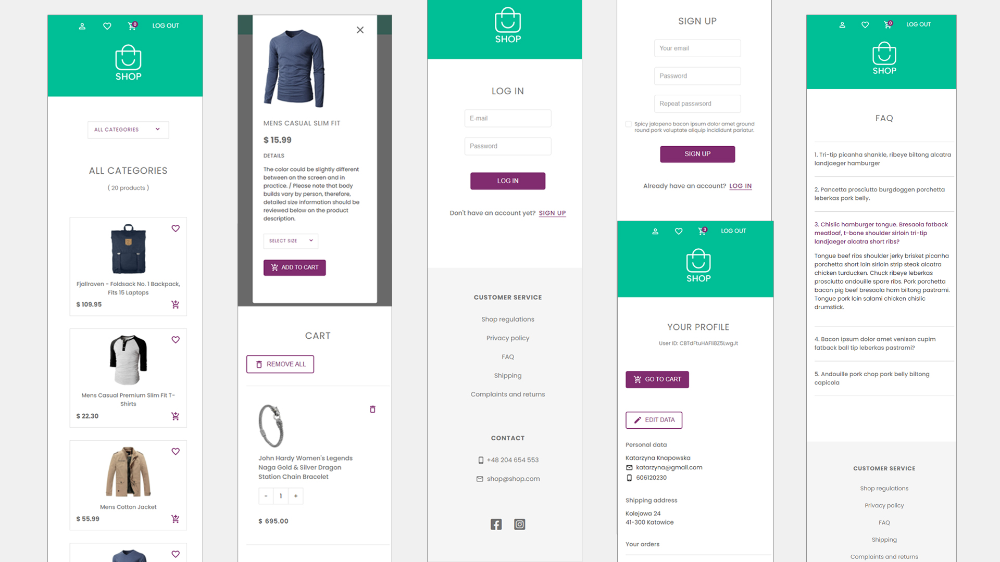
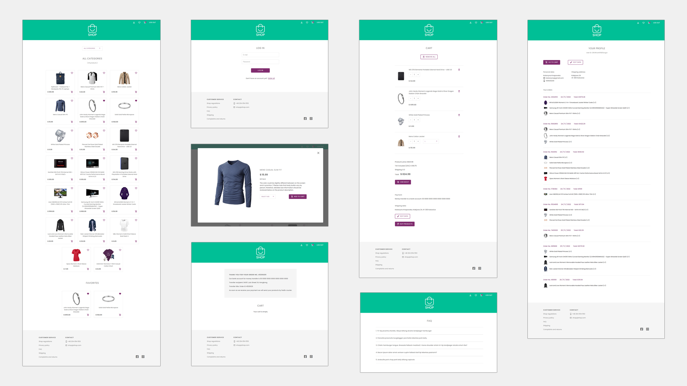

# SHOP-app

This is online store web application created in ReactJS.
I created the application on the basis of my own UX/UI project idea.

## NOTE!
User authentication is provided with Firebase auth.
You can sign up with your own (fake) data or You can use email: test@shop.pl & password: testshopapp for overview and testing 

## App sections

The SHOP application consist of a few pages:

1. Home page with available products' cards
2. Cart page with cart summary
3. Log in / Sign up / Profile page
4. Shipping / Privacy Policy pages
5. FAQ page

## App functionalities

1. Login
2. Registration
3. Select category 
4. Product overview
5. Select size (available for clothing category)
6. Cart management (Add / Delete / Delete all)
7. Add to favorities
8. User informations overview (Personal data, shipping data, products bought)

## Technologies used

* [React](https://reactjs.org/)
* React Hooks
* [Redux Toolkit](https://redux-toolkit.js.org/)
* [React router](https://reactrouter.com/docs/en/v6)
* REST API - products fetched from [FAKE STORE API](https://fakestoreapi.com/)
* [Firebase Auth/Firestore](https://firebase.google.com/)
* [SCSS](https://sass-lang.com/documentation) for styling
* [Styled Components](https://styled-components.com/) for dropdown select
* Material UI icons / FontAwesome icons
* Flexbox
* RWD - the app is fully responsive

## Deployed on vercel.com
[https://shop-app-kasiaknapowska.vercel.app](https://shop-app-kasiaknapowska.vercel.app)

## Screenshots

### Author: Katarzyna Knapowska